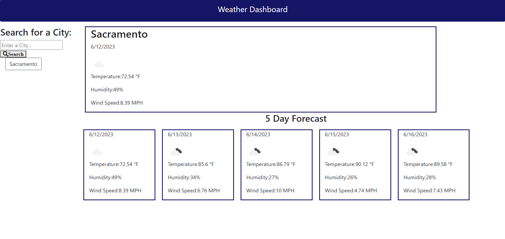

# Weather-Dashboard

### By Patrick Lowe

## Description

#### An App where you search for the city and you receive back The weather forecast for the next five days using https://api.openweathermap.org API to fetch the data.

## Technologies Used

### JavaScript

### HTML

### CSS

### Visual Studio Code

### GitBash

### [Open Weather API](https://api.openweathermap.org)

### JQuery

## Installation

#### You can visit the delpoyed [website](https://patrickwlowe.github.io/Weather-Dashboard/), or clone the repository and open the folder locally.

## Acceptance Criteria

```
GIVEN a weather dashboard with form inputs
WHEN I search for a city
THEN I am presented with current and future conditions for that city and that city is added to the search history
WHEN I view current weather conditions for that city
THEN I am presented with the city name, the date, an icon representation of weather conditions, the temperature, the humidity, and the wind speed
WHEN I view future weather conditions for that city
THEN I am presented with a 5-day forecast that displays the date, an icon representation of weather conditions, the temperature, the wind speed, and the humidity
WHEN I click on a city in the search history
THEN I am again presented with current and future conditions for that city
```

## Screenshot of Website



## References

#### https://api.openweathermap.org

## Deployed Website

#### https://patrickwlowe.github.io/Weather-Dashboard/
